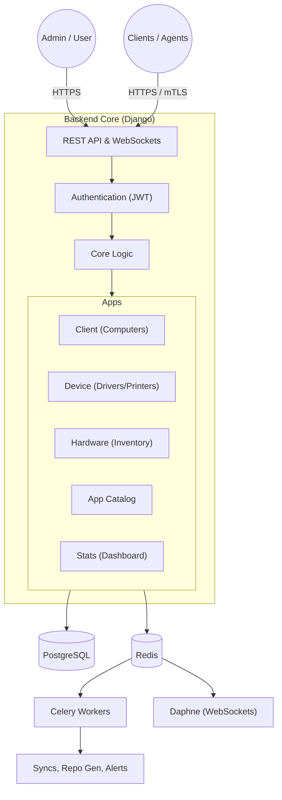

# 🚀 migasfree-backend Onboarding

Welcome to the team! 👋
This document is designed to give you a quick and clear overview of the `migasfree-backend` project so you can start contributing value from day one.

## 1. Big Picture 🗺️

`migasfree-backend` is the brain of the system. It is a **Django** application that exposes a **REST API** to manage computer fleets, inventory, and software deployments.

The architecture follows a modular design where each Django "app" encapsulates a specific business domain.



- **API**: The main entry point. Clients (agents installed on PCs) and the Frontend (Web Dashboard) consume this API.
- **Redis + Celery**: Manage heavy background tasks (synchronizing thousands of packages, regenerating repositories) and scheduled jobs.
- **WebSockets (Channels)**: Allow the Dashboard to show real-time statistics without reloading.

## 2. Tech Stack 💻

We chose these technologies for their maturity, robustness, and ecosystem:

- **Python 3.10+ & Django 5.x**: The industry standard for robust and fast-to-develop backends.
- **Django REST Framework (DRF)**: To build a powerful, browsable, and well-structured API.
- **PostgreSQL**: Reliable and powerful relational database with excellent JSON support (useful for flexible inventories).
- **Redis**: Used as a _broker_ for Celery and as a cache layer. Essential for performance.
- **Celery**: Handles asynchrony and task scheduling (Beat). Vital when you need to process data from thousands of computers without blocking the web server.
- **Daphne + Channels**: To support WebSockets and bring "life" to the dashboard.

## 3. Key Directories 📂

All the logic resides in the `migasfree/` package. Here is your treasure map:

- **Business Logic (Models)**:

  - `migasfree/client/models/`: Computers, Users, Errors.
  - `migasfree/core/models/`: Projects, Platforms, Packages.
  - `migasfree/device/models/`: Drivers, Printers.
  - _Tip:_ In this project, each model usually has its own file inside the `models/` folder.

- **API (Views and Serializers)**:

  - Look for `views/` folders and the `serializers.py` file inside each app (`api_v4`, `client`, `core`, etc.).

- **Configuration**:

  - `migasfree/settings/`: This is where the configuration lives. `base.py` (common), `development.py` (local), and `production.py`.

- **Tests**:
  - `tests/`: All tests are here, organized by functionality. We use `pytest`.

## 4. Workflow ⚙️

### A) Local Setup and Execution 🏃

1.  **Install dependencies**:

    ```bash
    pip install -e .[dev]
    ```

2.  **Start Database Services**:
    You need PostgreSQL and Redis running (usually via Docker or system services).

3.  **Run the Server (Django)**:

    ```bash
    python3 manage.py runserver 0.0.0.0:2345 --settings=migasfree.settings.development
    ```

    _Access the API at:_ `http://localhost:2345/docs/`

4.  **Run Workers (Optional for basic development, required for async tasks)**:

    ```bash
    DJANGO_SETTINGS_MODULE='migasfree.settings.development' \
    celery --app=migasfree.celery.app worker \
        --without-gossip \
        --concurrency=10 \
        --queues=default,pms-apt,pms-dnf,pms-pacman,pms-wpt,pms-yum,pms-zypper \
        --loglevel=DEBUG
    ```

5.  **Run Celery Beat (Required for scheduled tasks)**:
    ```bash
    DJANGO_SETTINGS_MODULE='migasfree.settings.development' celery --app=migasfree.celery.app beat --loglevel=DEBUG
    ```

### B) Running Tests 🧪

Quality is non-negotiable. Before submitting changes, make sure everything is green:

- **Run all tests**:
  ```bash
  pytest
  ```
- **Run tests with coverage**:
  ```bash
  pytest --cov=migasfree
  ```
- **Linting (Code Style)**:
  We use `ruff` to keep the code clean.
  ```bash
  ruff check migasfree/
  ```

### C) Deployment 🚀

Deployment in production is typically done as a standard Python package:

1.  **Installation**: `pip3 install migasfree-backend`
2.  **Server**: An ASGI server (like **Daphne**) must be used to support WebSockets, placed behind Nginx.
3.  **Environment Variables**: Set `DJANGO_SETTINGS_MODULE='migasfree.settings.production'` and point to your real DB/Redis.

---

**Pro Tip:** Start by reading `ARCHITECTURE.md` in the project root to dive into the details. Good luck! 🚀
