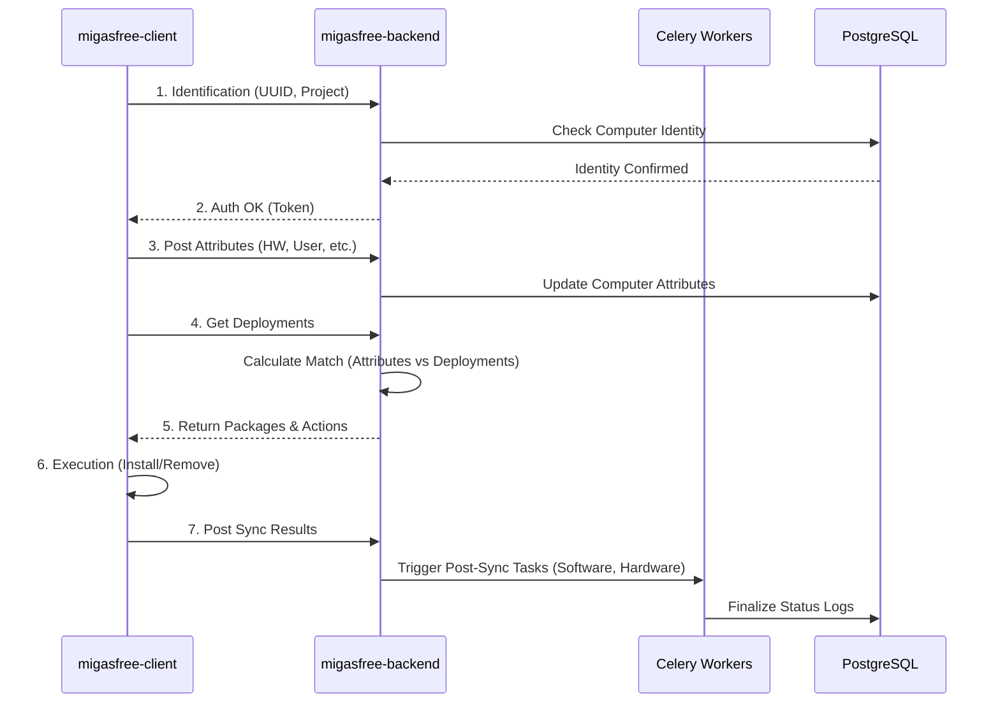

# 🧠 Explanation: Core Concepts

This document explains the fundamental concepts behind the Migasfree architecture.

## Entities

### Computers (Clients)

A **Computer** is any device managed by the Migasfree system.

- **Uniqueness**: Identified by a UUID or MAC address.
- **Inventory**: Stores detailed hardware (lshw) and software (pkg list) data.
- **State**: The server tracks the current state vs. the desired state.

### Projects

A **Project** is a logical namespace that groups related Deployments, typically corresponding to an Operating System version (e.g., "Ubuntu-22.04" or "Windows-10").

- **Scope**: Used to organize software for a specific platform.
- **Organization**: Contains multiple Deployments (e.g., "Base", "Updates", "Security").

### Deployments

A **Deployment** is a dynamic **package repository** managed by the server.

- **Definition**: Combines a set of packages (Internal or External origin) with targeting rules.
- **Targeting**: Uses **Attributes** to determine which computers receive the software.
- **Types**:
  - **Internal**: Packages uploaded directly to Migasfree.
  - **External**: Proxies/caches for external repositories (e.g., apt/yum mirrors).

## The Synchronization Cycle

Migasfree uses a **pull-based** architecture for scalability and security.

1. **Wakeup**: Client starts (usually scheduled).
2. **Handshake**: Client authenticates with the server.
3. **Context**: Client uploads **Attributes** and **Faults** to define its current context.
4. **Instruction**: Server calculates the "Desired State" based on the context and sends:
    - **Repositories**: Package sources.
    - **Mandatory Packages**: Software to install or remove.
5. **Convergence**: Client applies changes (installs/removes packages) to match the desired state.
6. **Report**: Client uploads the **new** Software and Hardware inventory to the server.
7. **Result**: Client reports the final status of the synchronization.

### Visual Flow

