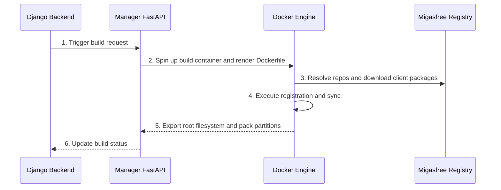

# 📀 Explanation: Migasfree Golden Images (MGI)

This document explains the concept of **Migasfree Golden Images (MGI)**, their build pipeline, and their security registration model.

---

## 1. Overview

**Migasfree Golden Image (MGI)** is a core feature in Migasfree 5 designed to generate minimal, standardized operating system root filesystems (Golden Images) for massive fleet deployments (similar to thin clients, kiosk machines, and cloud environments).

An MGI consists of:

- **Base OS**: The minimal operating system (e.g. Debian 13 "Trixie", Ubuntu 24.04).
- **Core Packages**: The default packages and configurations defined for a specific platform.
- **Migasfree Client & Agent**: Pre-installed and pre-configured tools linking the image back to the central Migasfree Server.
- **Partition Layout**: Defining target filesystems and RAW partitions (e.g., `SYSTEM.raw`, `boot.raw`) for raw sector-level imaging.

---

## 2. The MGI Build Pipeline

MGI generation is orchestrated via an asynchronous background engine leveraging Docker containers:



1. **Triggering**: A superadmin issues a POST request to `/api/v1/token/mgi/release/{id}/build/`. The request is proxied internally to the `inv_manager` microservice inside the Swarm cluster.
2. **Jinja2 Rendering**: The manager loads the target MGI template (`mgi_config`) and renders a Dockerfile using project-specific properties.
3. **Docker Build**: The image is compiled in a sandbox. The container automatically adds host routes to resolve internal services (`inv.org`) via `--add-host`.
4. **Client Sync**: During the compilation phase, the container runs:

   ```bash
   migasfree conf --server inv.org --project Debian-13
   migasfree register
   migasfree sync
   ```

5. **Sectorization**: The resulting container root filesystem is extracted, packaged, and formatted as ext4 partitions (`SYSTEM.raw`) with correct filesystems and UUID metadata.
6. **Catalog Update**: The generated assets are moved to `/pool/mgi/` and indexed in `catalog.json` for clients to download.

---

## 3. Current Registration Security Model

To synchronize and populate its initial cache during the build phase, the client inside the build container MUST register itself against the Migasfree database.

Currently, this registration relies on the target **Project's** configuration:

- **`auto_register_computers = True`**:
  - **How it works**: The registration API allows the new client to automatically register itself and sign its client certificate without needing password/token authorization credentials.
  - **Limitation**: While it makes the unattended build pipeline completely hands-off, keeping `auto_register_computers` enabled in production projects presents a **security risk**, as any unauthenticated machine knowing the project key could register itself.
- **`auto_register_computers = False`**:
  - **How it works**: New client registrations are blocked unless explicitly authorized via administrator/registration tokens.
  - **Limitation**: During the unattended MGI build, the `migasfree register` command encounters an authorization prompt, blocking the build or throwing an `EOFError`.
