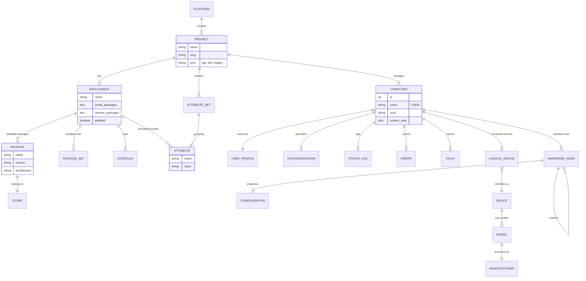

# 🗂️ Data Model Reference

This document provides a visual and descriptive reference of the **migasfree-backend** database schema. Key relationships between Core, Client, Hardware, and Device modules are illustrated below.

## 🗺️ Entity-Relationship Diagram

## 📚 Entity Descriptions

### Core Module

* **`Project`**: Represents an isolated tenant or scope (e.g., "Windows", "Linux Workstations"). Defines the Package Management System (PMS) used.
* **`Deployment`**: A software repository configuration. It defines which packages are available, installed, or removed for computers matching specific criteria.
* **`Attribute`**: Key-value pairs assigned to computers (e.g., `role=server`, `room=101`) used to filter Deployments.

### Client Module

* **`Computer`**: The central entity representing a managed device. Unique by UUID/FQDN within a Project.
* **`Synchronization`**: A record of a client connecting to the server to update its state.
* **`UserProfile`**: Represents the system administrator or user responsible for a set of computers (multitenancy).

### Hardware Module

* **`HardwareNode`**: Recursive tree structure (lshw-like) storing granular hardware details (CPU > Cache, Bus > Network Card).
* **`Configuration`**: Key-value properties of a hardware node (e.g., `speed=1000Mbps`).

### Device Module

* **`Device`**: Abstract definition of a physical peripheral (e.g., "Generic USB Printer").
* **`LogicalDevice`**: A concrete instance of a device connected to a specific `Computer`.
