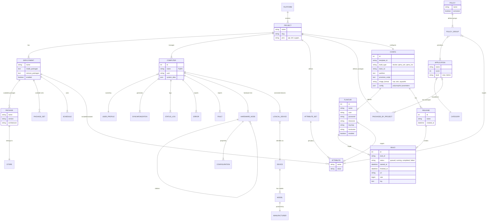

# 🗂️ Data Model Reference

This document provides a visual and descriptive reference of the **migasfree-backend** database schema. Key relationships between Core, Client, Hardware, and Device modules are illustrated below.

## 🗺️ Entity-Relationship Diagram


```mermaid
erDiagram
    %% CORE MODULE
    PLATFORM ||--|{ PROJECT : contains
    PROJECT ||--|{ DEPLOYMENT : has
    PROJECT ||--|{ COMPUTER : manages
    PROJECT ||--|{ ATTRIBUTE_SET : defines
    
    DEPLOYMENT ||--o{ PACKAGE : "available packages"
    DEPLOYMENT ||--o{ PACKAGE_SET : "available sets"
    DEPLOYMENT ||--|{ SCHEDULE : uses
    DEPLOYMENT ||--o{ ATTRIBUTE : "included/excluded"
    
    PACKAGE ||--|| STORE : "belongs to"
    
    ATTRIBUTE_SET ||--|{ ATTRIBUTE : grouping

    %% CLIENT MODULE
    COMPUTER }|--|| USER_PROFILE : "owned by"
    COMPUTER ||--|{ SYNCHRONIZATION : generates
    COMPUTER ||--|{ STATUS_LOG : logs
    COMPUTER ||--|{ ERROR : reports
    COMPUTER ||--|{ FAULT : reports
    
    %% HARDWARE MODULE
    COMPUTER ||--|{ HARDWARE_NODE : "hardware tree"
    HARDWARE_NODE ||--o{ HARDWARE_NODE : "children"
    HARDWARE_NODE ||--|{ CONFIGURATION : "properties"
    
    %% DEVICE MODULE
    DEVICE ||--|{ MODEL : "has models"
    MODEL ||--|| MANUFACTURER : "produced by"
    COMPUTER ||--|{ LOGICAL_DEVICE : "connected devices"
    LOGICAL_DEVICE }|--|| DEVICE : "identifies as"

    %% APP CATALOG MODULE
    APPLICATION }|--|| CATEGORY : "classified in"
    APPLICATION }|--|{ PACKAGES_BY_PROJECT : "has packages"
    PROJECT ||--|{ PACKAGES_BY_PROJECT : "defines packages"
    POLICY ||--|{ POLICY_GROUP : "defines groups"
    POLICY_GROUP }|--|{ APPLICATION : "prioritizes"
    POLICY_GROUP }|--|{ ATTRIBUTE : "targets"

    %% MCI (MANAGED CONFIGURATION INFRASTRUCTURE) MODULE
    PROJECT ||--|| CONFIG : "configures"
    CONFIG ||--|{ FLAVOUR : "defines"
    CONFIG ||--|{ RELEASE : "has"
    RELEASE ||--|{ BUILD : "creates"
    FLAVOUR ||--|{ BUILD : "target"
    FLAVOUR }|--|{ ATTRIBUTE : "targets"

    %% ENTITY DEFINITIONS
    PROJECT {
        string name
        string slug
        string pms "apt, dnf, zypper..."
    }

    COMPUTER {
        int id
        string name "FQDN"
        string uuid
        json system_data
    }

    DEPLOYMENT {
        string name
        text install_packages
        text remove_packages
        boolean enabled
    }

    PACKAGE {
        string name
        string version
        string architecture
    }

    ATTRIBUTE {
        string name
        string value
    }

    APPLICATION {
        string name
        int score
        string level "User, Admin"
    }

    POLICY {
        string name
        boolean exclusive
    }

    CONFIG {
        int id
        string template_id
        string build_type "docker, qemu_win, qemu_lnx"
        string base_os
        text partition
        text provision_script
        string image_format "raw, wim, squashfs"
        json config "polymorphic parameters"
    }

    FLAVOUR {
        int id
        string name
        string user
        string password
        string timezone
        string keymap
        string hostname
        boolean enabled
    }

    RELEASE {
        int id
        string name
        datetime created_at
    }

    BUILD {
        int id
        string task_id
        string status "queued, running, completed, failed"
        datetime started_at
        datetime finished_at
        string uri
        bigint size
        text log
    }
```

## 📚 Entity Descriptions

### Core Module

* **`Project`**: Represents an isolated tenant or scope (e.g., "Windows", "Linux Workstations"). Defines the Package Management System (PMS) used.
* **`Deployment`**: A software repository configuration. It defines which packages are available, installed, or removed for computers matching specific criteria.
* **`Attribute`**: Key-value pairs assigned to computers (e.g., `role=server`, `room=101`) used to filter Deployments.

### Client Module

* **`Computer`**: The central entity representing a managed device. Unique by UUID/FQDN within a Project.
* **`Synchronization`**: A record of a client connecting to the server to update its state.
* **`UserProfile`**: Represents the system administrator or user responsible for a set of computers (multitenancy).

### Hardware Module

* **`HardwareNode`**: Recursive tree structure (lshw-like) storing granular hardware details (CPU > Cache, Bus > Network Card).
* **`Configuration`**: Key-value properties of a hardware node (e.g., `speed=1000Mbps`).

### Device Module

* **`Device`**: Abstract definition of a physical peripheral (e.g., "Generic USB Printer").
* **`LogicalDevice`**: A concrete instance of a device connected to a specific `Computer`.

### App Catalog Module

* **`Application`**: Software application made available in the organization's catalog.
* **`Category`**: Classification for catalog applications (e.g., "Office", "Graphics").
* **`Policy`**: Complex rules for installing/uninstalling applications based on priorities.
* **`PolicyGroup`**: Groups that define priority levels for installing applications on targeted attributes.

### MCI (Managed Configuration Infrastructure) Module

* **`Config`**: Defines the builder configuration template for a project. Supports polymorphic engines (Docker for Linux, QEMU Unattended for Windows) and dynamic parameters inside a JSONB field.
* **`Flavour`**: A system variant or edition of the configuration (e.g., "Desktop", "Minimal", "Server") specifying credentials, keyboard layout, timezone, and targeting attributes.
* **`Release`**: A versioned snapshot of an MCI configuration ready for building.
* **`Build`**: Tracks individual asynchronous tasks (run via Celery/Redis) that construct the system images, capturing compilation logs, build state, and output file size/URLs.

---

### 🧬 Polymorphic `config` JSONB Schema Examples

The `config` field of the `Config` table adapts its structure dynamically based on the selected `build_type` parameter:

#### 1. Linux Docker Builder (`build_type = "docker"`)
For Linux container-based construction, the JSON object maps a single required `dockerfile` key to house the full Jinja2 template structure:
```json
{
  "dockerfile": "FROM debian:12-slim\nRUN apt-get update && apt-get install -y migasfree-client\nCOPY defaults/ /usr/share/mcs/"
}
```

#### 2. Windows QEMU Builder (`build_type = "qemu_win"`)
For Windows VM-based builds, the JSON contains hardware provisioning parameters alongside unattended installation templates:
```json
{
  "disk_size_gb": 40,
  "vm_ram_mb": 4096,
  "vm_cpus": 4,
  "autounattend_template": "<?xml version=\"1.0\" encoding=\"utf-8\"?>\n<unattend xmlns=\"urn:schemas-microsoft-com:unattend\">\n  <settings pass=\"oobeSystem\">\n    <component name=\"Microsoft-Windows-Shell-Setup\" processorArchitecture=\"amd64\" ...>\n      <OOBE>\n        <HideEULAPage>true</HideEULAPage>\n      </OOBE>\n    </component>\n  </settings>\n</unattend>",
  "setupcomplete_template": "@echo off\ncmd.exe /c powershell -ExecutionPolicy Bypass -File C:\\Windows\\Setup\\Scripts\\provision-migasfree.ps1"
}
```
