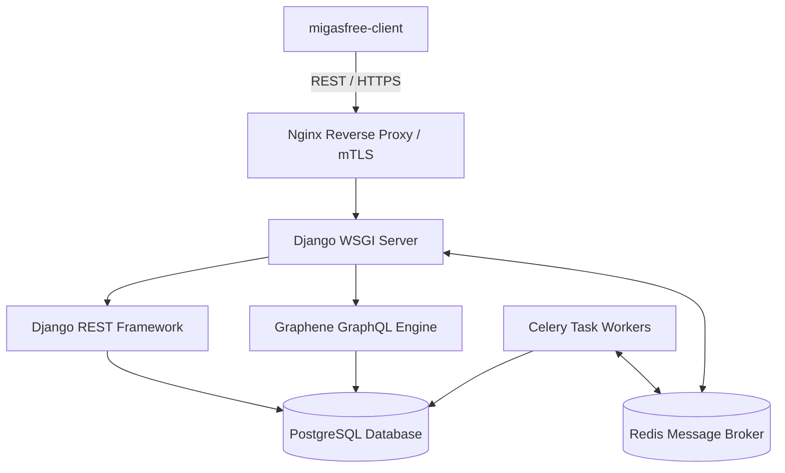

# Migasfree Backend — Product Requirements Document (PRD)

> [!NOTE]
> This PRD describes the functional and technical requirements of **migasfree-backend** (v5.x+), the central server component of the Migasfree fleet management system. It has been reverse-engineered using the `code-to-prd` standard.

---

## 1. System Overview

**migasfree-backend** is a high-performance, centralized fleet management and software deployment server built on **Django 5.x** and **Django REST Framework (DRF)**. It orchestrates software catalogs, captures client hardware/software metrics, processes analytical data, configures peripherals, and manages cryptographic key distribution.



### Core Business Pillars

1. **Dynamic Policy Orchestration**: Resolves dynamic machine attributes and filters target software/repositories for millions of endpoints in real time.
2. **Mutual Trust & Administrative Identity**: Implements secure client enrollment, mutual TLS (`mTLS`) for restricted API routers, and payload verification using asymmetric project keys.
3. **High-Efficiency Inventory Capture**: Manages high-throughput hardware profiles (lshw formats) and full package sets with PostgreSQL-optimized indices.
4. **Asynchronous System Tasks**: Offloads intensive tasks (repository building, background sync logging, clean-up operations) to **Celery** workers backed by **Redis**.
5. **Double API layer**: Exposes a structured REST API (v5) for secure client communications, an advanced **GraphQL** layer for high-fidelity dashboards (e.g. Quasar-based `migasfree-frontend`), and a monolithic fallback API (`api_v4`) for backwards compatibility.

---

## 2. Core Functional Modules

| Module | Purpose | Tech Stack Components |
| :--- | :--- | :--- |
| **`migasfree.core`** | System configuration backbone: manages projects, deployments, packages, repositories, dynamic properties, and store groups. | Django ORM, SimpleJWT, simple tokens. |
| **`migasfree.client`**| Computer synchronization engine: manages registered endpoints, sync logs, evaluated faults, and traits. | DRF, simple tokens, custom mTLS middleware. |
| **`migasfree.device`**| Peripheral hardware management: tracks and configures system printers, driver associations, and physical printer states. | Django ORM, REST serializers. |
| **`migasfree.hardware`**| Hardware profile database: parses and stores detailed system architectures, CPU layouts, memory details, and PCI states. | Django REST views, PostgreSQL indices. |
| **`migasfree.stats`** | Historical data aggregator: aggregates sync statuses and performance indicators for live dashboard statistics. | Django aggregation, Django caching. |
| **`migasfree.api_v4`**| Backward compatibility: provides legacy endpoints for v4 clients. | Legacy monolithic REST controllers. |
| **GraphQL API** | Administrative control: delivers high-performance queries and mutations for client dashboard interfaces. | Graphene-Django, DataLoaders. |

---

## 3. Global Authentication & Permission Model

`migasfree-backend` enforces three strict layers of access depending on the API endpoint namespace:

```
[REST API Endpoint]
   ├── /api/v1/public/ ────────► Anonymous Access Allowed (e.g., Public Keys, Server Info)
   │
   ├── /api/v1/safe/ ──────────► Mutual TLS Authentication (mTLS) + Cryptographic Signature Check
   │                             (Exclusive for registered clients executing sync/register)
   │
   └── /api/v1/token/ ─────────► Django REST Framework Token / SimpleJWT Token
                                 (Exclusive for administrators, packagers, and frontends)
```

1. **Anonymous / Public Endpoints**: Used for server status checks, public GPG repository key delivery, and initial registration handshakes.
2. **Mutual TLS (mTLS) Endpoints (`/api/v1/safe/`)**: Restricted to enrolled client agents. Client identity is validated by the system's private CA cert at the web-server layer, and request signatures are verified in memory by safe router middlewares.
3. **Authenticated REST & GraphQL (`/api/v1/token/`)**: Used by administrators, developers, and the Quasar frontend. Employs DRF Tokens for simple API clients and JWT (JSON Web Tokens) for rich frontend interfaces.

---

## 4. Architectural Rules & Best Practices

> [!IMPORTANT]
>
> - **PostgreSQL native features**: Database operations must be optimized for PostgreSQL. Native SQL and optimized Django QuerySets (`select_related`, `prefetch_related`) are mandatory to prevent N+1 query patterns.
> - **Idempotent Celery Workers**: Background tasks (e.g., package indexing) must be idempotent. They should safely handle task retries and lock collisions using Redis locks.
> - **Data Migration Safety**: All Django migrations must be reversible. Destructive operations on historical tables must be preceded by an automated backup step.
