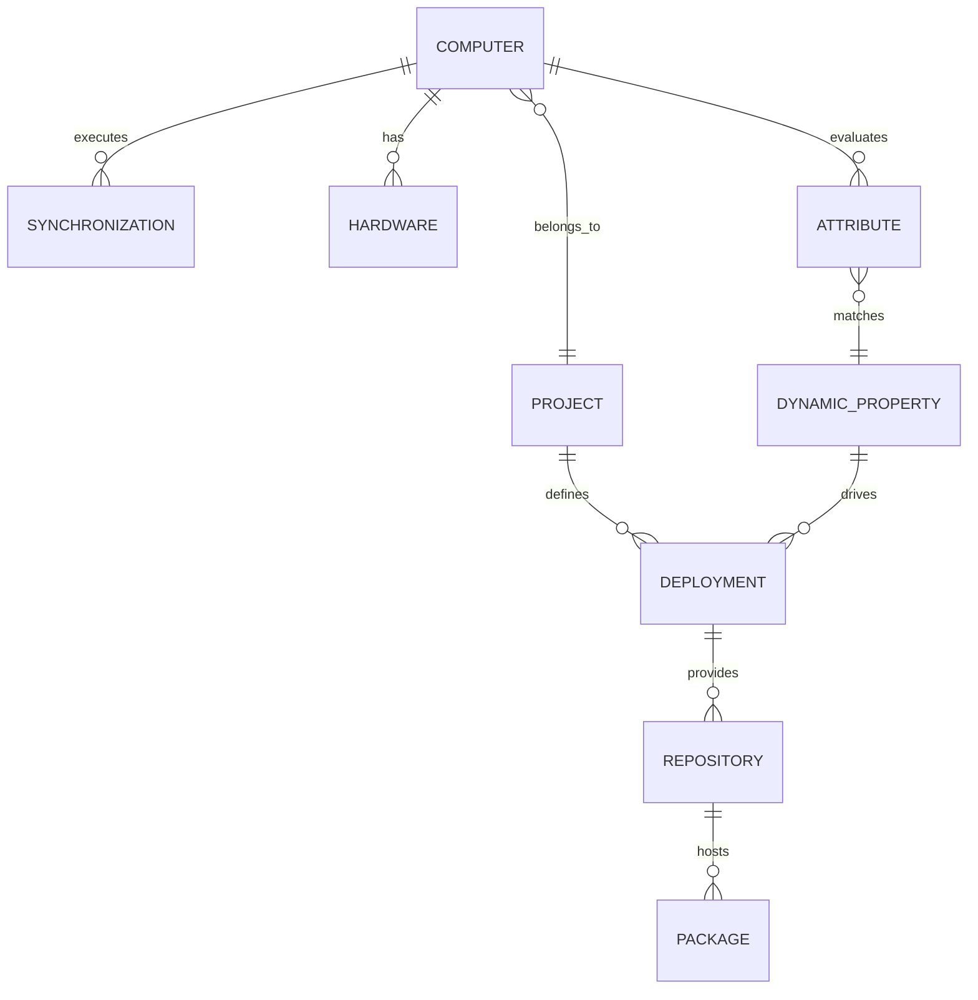
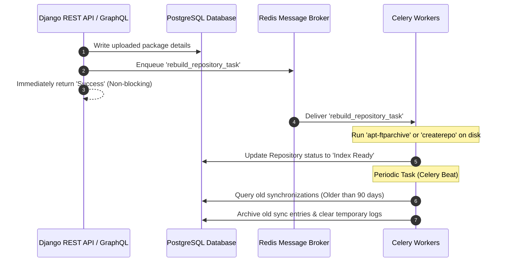

# Entity-Relationship Flows & Data Coupling

This document maps out the high-level entity-relationship (ER) flows, data couplings, and background task handshakes of `migasfree-backend`.

---

## 1. High-Level Entity Relationship Flow

The database relationships coordinate dynamic updates and package delivery based on machine attributes.

---

## 2. Background Task Handshake & Event Loops

Intensive actions (such as repository rebuilding or periodic cleanup) are offloaded asynchronously to keep the primary API thread fast.

---

## 3. Core Database Coupling & Cascades

To maintain referential integrity, database entities employ strict delete/cascade rules across modules:

| Source Model | Linked Model | Relationship | Cascade Rule & Description |
| :--- | :--- | :--- | :--- |
| `Project` | `Computer` | ForeignKey | `PROTECT`: Deleting a project is blocked if registered computers still reference it, preventing orphan machine profiles. |
| `Computer` | `Synchronization` | ForeignKey | `CASCADE`: Deleting a computer automatically purges its synchronization logs, errors, and physical printer changes. |
| `Repository` | `Package` | ManyToMany | `SET_NULL` or Custom cleanups: Obsolete repository channels do not delete package binaries, allowing them to remain in storage for rollback purposes. |
| `Deployment` | `AttributeSet` | ForeignKey | `SET_NULL`: If an attribute filter set is removed, the deployment defaults to global availability, rather than breaking. |
