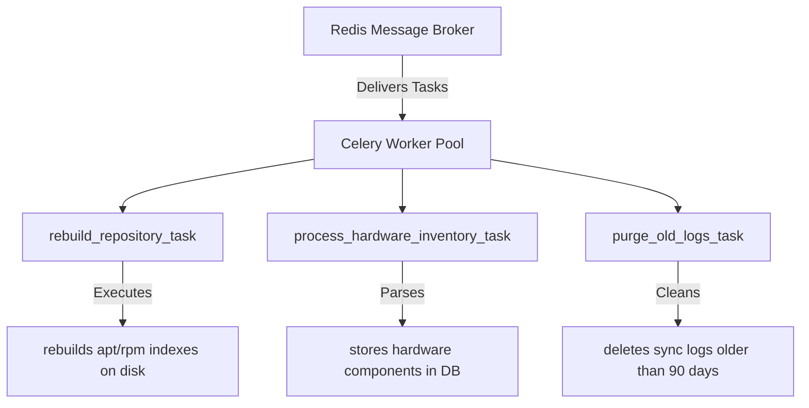

# Service: Asynchronous Tasks & Celery Queue

> **Scope:** Background Daemon Processes
> **Access Privilege:** **Internal System Only**
> **Module:** `migasfree.client.tasks`, `migasfree.core.tasks`

---

## 1. Overview

`migasfree-backend` uses **Celery** with **Redis** as a message broker to handle long-running, resource-intensive, and scheduled background tasks. This keeps the primary Django REST/GraphQL API threads fast and responsive.

---

## 2. Core Background Tasks

The Celery worker pool processes three primary categories of background tasks:

### 1. Repository Rebuilding (`rebuild_repository_task`)

- **Trigger**: Fired when a package or package set is uploaded via `POST /api/v1/safe/packages/` or updated in the admin panel.
- **Action**: Initiates the rebuilding of local repository metadata indexes (e.g., executing `apt-ftparchive` or `createrepo`).
- **Resource Lock**: Employs Redis-based locks to prevent multiple concurrent repository builds on the same repository folder, preventing metadata corruption.

### 2. Bulk Hardware Parsing (`process_hardware_inventory_task`)

- **Trigger**: Fired asynchronously post-upload from the client sync cycle.
- **Action**: Processes complex `lshw` XML or JSON structures, categorizing elements into separate hardware tables (`cpu`, `ram`, `disk`). This keeps the client's synchronous API request short.

### 3. Log Purging & Analytics (`purge_old_logs_task`)

- **Trigger**: Periodic cron-like job controlled by **Celery Beat**.
- **Action**: Removes synchronization records, system state logs, and diagnostic errors older than 90 days to prevent PostgreSQL database bloat.
